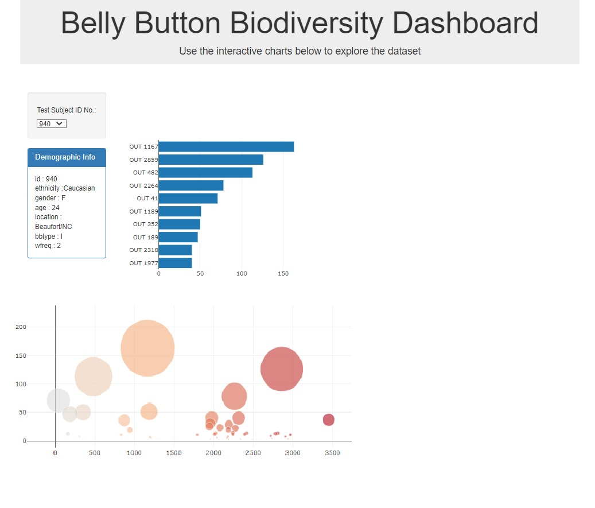

# belly-button-challenge
 In this challenge, I built an interactive dashboard to explore the Belly Button Biodiversity dataset from a provided URL and
 deployed the app. In the dashboard we have a dropdown menu to select each individual's id. All dempgraphic features of that individual will be displayed on the demographic box. Then the two following charts will be updated according to the selected id:
 
 - A horizontal bar chart to display the top 10 OTUs(operational taxonomic units) found in that individual.
 - A bubble chart that displays each sample

> You can find it here: [Belly Button Biodiversity Dashboard](http://sara-arasteh.com/belly-button-challenge/) 
-------
> 
> 
 

## Resources
- The Java Script file(app.js) is inside the static folder.
- The html file (index.html)
